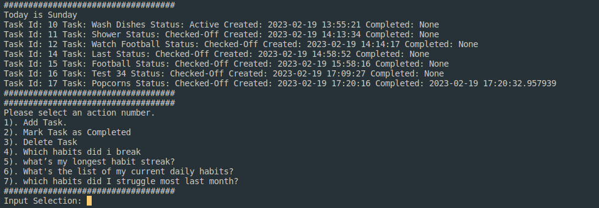

# HABIT TRACKER
### Requirements
<ul>
    <li>Python - you must have python running in your machine</li>
    <li>mysql connector install throught <code>pip install mysql-connector-python</code></li>
    <li>mysql database</li>
</ul>

### About Project

Habit tracker is a <code>CLI</code> tool that allows users to set and track their tasks within the set period of time.

### Users Stries
<ul>
    <li>Add task</li>
    <li>Mark task as completed</li>
    <li>Check the most streak task</li>
    <li>Check the least streak task</li>
    <li>Check the most struggled task</li>
</ul>

### Creating a database
<ul>
    <li>you can use <code>xampp</code> or <code>sql</code> database</li>
    <li>Create a database called <code>TaskTracker</code> if you wish to use another database name change it in <code>db_connection.py</code> at <code>self.database='New db name'</code></li>
    <li>Creating tables run <code>python create_tables.py</code></li>
</ul>

### How to run the project

The project is an object oriented and has two major classes that is <code>Tasks</code> that has all the methods required to view, add delete and do many more operations and <code>Database</code> which is responsible for connecting to mysql database

To run the project in your terminal you need to be in your current working directory and run <code>python start.py</code> which has all the functions to perform all the user stories.

### How to create task

When you run <code>python start.py</code> you will be provided with a cli interface with a list of actions and triggers, you will need to select a trigger for every operations you need to perform as directed 

NB: Follow cli to interact more with the app